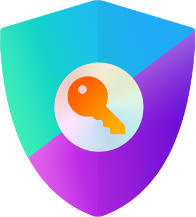

# Next Auth V5 Implementation
<a id="readme-top"></a>
<!-- PROJECT LOGO -->
<br />
<div align="center">
  <a href="https://github.com/next_auth_implementation">
    
  </a>

  <h3 align="center">Next Auth Implementation</h3>

  <p align="center">
    An implementation of <a href="https://next-auth.js.org/"><strong>NextAuth.js</strong></a> built as a reference for easy addition of Next Auth to future projects.
    <br />
  </p>
</div>


<!-- TABLE OF CONTENTS -->
<details>
  <summary>Table of Contents</summary>
  <ol>
    <li>
      <a href="#about-the-project">About The Project</a>
      <ul>
        <li><a href="#built-with">Built With</a></li>
      </ul>
    </li>
    <li>
      <a href="#getting-started">Getting Started</a>
      <ul>
        <li><a href="#prerequisites">Prerequisites</a></li>
        <li><a href="#installation">Installation</a></li>
      </ul>
    </li>
    <li><a href="#usage">Usage</a></li>
    <li><a href="#roadmap">Roadmap</a></li>
    <li><a href="#license">License</a></li>
    <li><a href="#contact">Contact</a></li>
    <li><a href="#acknowledgments">Acknowledgments</a></li>
  </ol>
</details>


<!-- ABOUT THE PROJECT -->
## About The Project

![Login screenshot][login-screenshot]


<p align="right">(<a href="#readme-top">back to top</a>)</p>


### Built With
[![NextJS][Next.js]][NextJS-url]\
[![AuthJS][Auth.js]][AuthJS-url]\
[![TailwindCSS][TailwindCSS.com]][Tailwind-url]\
[![PostgreSQL][PostgreSQL.com]][PostgreSQL-url]\
[![Neon][Neon.com]][Neon-url]


<p align="right">(<a href="#readme-top">back to top</a>)</p>


<!-- GETTING STARTED -->
## Getting Started

**NOTE**: *This project is not complete and served strictly as group learning project.*\
To get a local copy up and running follow these steps.

### Prerequisites

Node and NPM are required.
  ```sh
  npm install npm@latest -g
  ```

### Installation

**NOTE:** _This was a learning project and not in any way a finished, secure or stable application._

1. Clone the repo
   ```sh
   git clone https://github.com/tonyb650/next_auth_implementation.git
   ```
2. Install NPM packages for `server` and `client` folders
   ```sh
   npm install
   ```
3. Create database with Mongo Community Edition or MongoDB Atlas
4. Create `server/.env` file and populate with environment variables
   ```json
    ACCESS_TOKEN_SECRET="random_string_of_characters"
    REFRESH_TOKEN_SECRET="random_string_of_characters"
    MONGO_USERNAME="username"
    MONGO_PASSWORD="password"
    SERVER_PORT=8000
   ```
5. Create `client/.env` file and populate with environment OpenWeatherMap API key
    ```json
    VITE_REACT_APP_API_KEY="your_open_weather_map_api_key"
    ```
6. Update the DB connection string in `server/config/mongoDB.config.ts` to reflect the MongoDB you are connecting to.
7. Change git remote url to avoid accidental pushes to base project
   ```sh
   git remote set-url origin github_username/repo_name
   git remote -v # confirm the changes
   ```
8. Run scripts `npm run dev` for both server and client apps.

<p align="right">(<a href="#readme-top">back to top</a>)</p>


<!-- USAGE EXAMPLES -->
## Usage

### Logging In
![Logging In][login-screenshot]

...more...

<p align="right">(<a href="#readme-top">back to top</a>)</p>


<!-- ROADMAP -->
## Roadmap

This was a learning project only and there will be no further development.

<p align="right">(<a href="#readme-top">back to top</a>)</p>


<!-- LICENSE -->
## License

Distributed under the Unlicense License. See `LICENSE.txt` for more information.

<p align="right">(<a href="#readme-top">back to top</a>)</p>


<!-- CONTACT -->
## Contact

Tony Brierly

[![LinkedIn][linkedin-shield]][linkedin-url]

Project Link: [Next Auth Implementation](https://github.com/tonyb650/next_auth_implementation.git)

<p align="right">(<a href="#readme-top">back to top</a>)</p>


<!-- ACKNOWLEDGMENTS -->
## Acknowledgments

* [Code With Antonio](https://www.youtube.com/watch?v=1MTyCvS05V4/)
* [ShadCN](https://ui.shadcn.com/)
* [Best Readme Template](https://github.com/othneildrew/Best-README-Template)
* [Choose an Open Source License](https://choosealicense.com)
* [Img Shields](https://shields.io)

<p align="right">(<a href="#readme-top">back to top</a>)</p>


<!-- MARKDOWN LINKS & IMAGES -->
<!-- https://www.markdownguide.org/basic-syntax/#reference-style-links -->

[join-event-animation]: z_readme_assets/join_event.gif
[add-event-animation]: z_readme_assets/add-event.gif
[search-events-animation]: z_readme_assets/search-events.gif
[event-chat-animation]: z_readme_assets/event-chat.gif
[event-details-animation]: z_readme_assets/event-details.gif
[login-screenshot]: public/readme/next-auth-screenshot.png

[event-details-screenshot]: z_readme_assets/event-details-screenshot.png
[user-login-screenshot]: z_readme_assets/user-login-screenshot.png
[user-register-screenshot]: z_readme_assets/user-register-screenshot.png

[linkedin-shield]: https://img.shields.io/badge/-LinkedIn-black.svg?style=for-the-badge&logo=linkedin&colorB=555
[linkedin-url]: https://linkedin.com/in/tony-brierly

[Next.js]: https://img.shields.io/badge/Nextjs-000000?style=for-the-badge&logo=next.js&logoColor=ffffff
[Nextjs-url]: https://nextjs.org/

[Auth.js]: https://img.shields.io/badge/Authjs-7c3aed?style=for-the-badge&logo=authjs&logoColor=ffffff
[Authjs-url]: https://auth.js/

[TailwindCSS.com]: https://img.shields.io/badge/tailwindcss-041f30?style=for-the-badge&logo=tailwindcss&logoColor=00bcff
[Tailwind-url]: https://tailwindcss.com

[PostgreSQL.com]: https://img.shields.io/badge/postgresql-4169E1?style=for-the-badge&logo=postgresql&logoColor=white
[PostgreSQL-url]: https://postgresql.org/

[Neon.com]: https://img.shields.io/badge/Neon-02e599?style=for-the-badge
[Neon-url]: https://neon.com/
